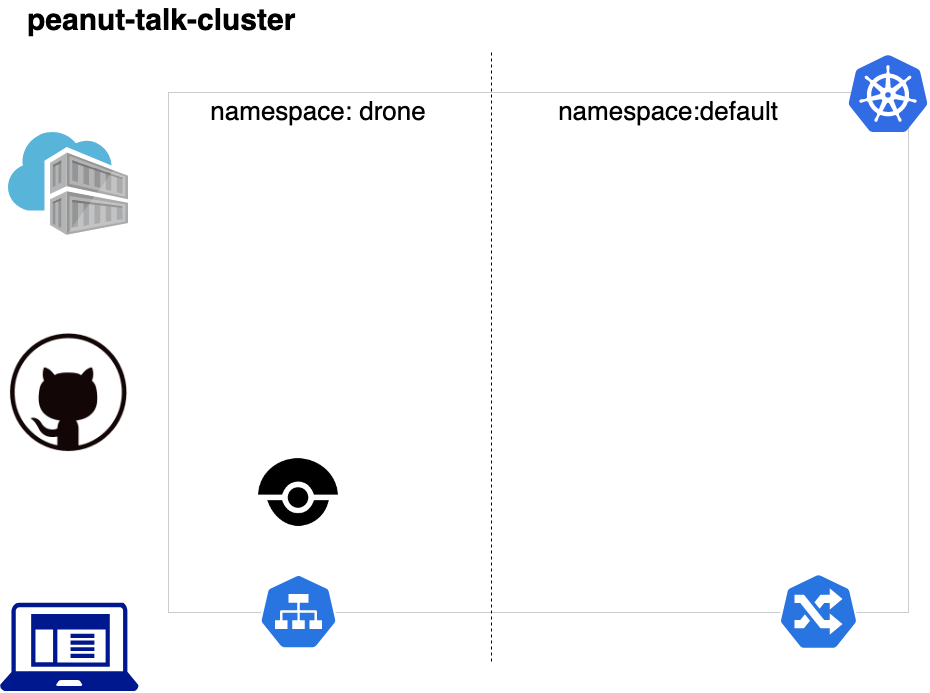

### Terraform demo

This is a basic terraform example using three differents providers to achieve a basic infraestructure:

* A kubernetes cluster(GKE)
* A drone CI server living in its own namespace
* A kong api gateway to serve as our apis door

The demo assumes that the credentials for a google services account with the required permissions is located in [../k8s-configuration/access.json](../k8s-configuration/access.json)

The following variables are expected as input:

|variable name|description|
|---|---|
|project_name|google project in which the cluster will live.|
|linux_admin_username|User name for authentication to the Kubernetes linux agent virtual machines in the cluster.|
|linux_admin_password|The password for the Linux admin account.|
|gcp_cluster_count|Count of cluster instances to start.|
|cluster_name|Cluster name for the GCP Cluster.|
|cluster_zone|Cluster zone.|
|github_client_secret|The client secret to connect drone to github.|
|github_client_id|The client id to connect drone to github.|
|github_user|The github user account.|

And the following will be provided as output:

|variable name|description|
|---|---|
|gcp_cluster_endpoint|Public IP of the GKE|
|gcp_ssh_command|command to connect via ssh to our cluster machines|
|drone_endpoint|drone Load Balancer public IP address|
|kong_endpoint|kong public IP address, aka. where we can reach for our apis latter|

## Prerequistes

- Credentials for a valid Google Service Account
- local install of [gcloud sdk](https://cloud.google.com/sdk/install)
- local install of [kubectl](https://kubernetes.io/es/docs/tasks/tools/install-kubectl/)
- local install of [terraform](https://www.terraform.io/)
- local install of [helm](https://helm.sh/)

## Running

After clonning the project and just once run `terraform init`

To review the changes in the state that will be applied run `terraform plan`

To create the infra just run `terraform apply` and voila.